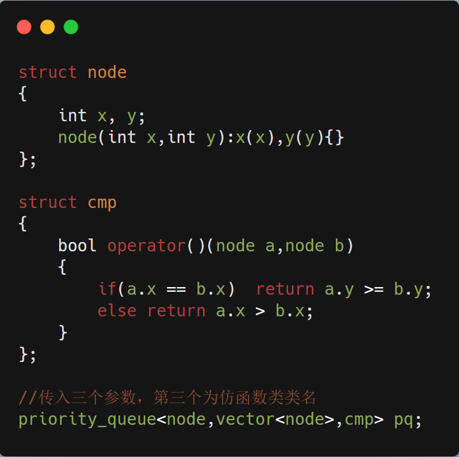

## 1046.最后一块石头的重量

### 题目描述：

有一堆石头，每块石头的重量都是正整数。

每一回合，从中选出两块 最重的 石头，然后将它们一起粉碎。假设石头的重量分别为 x 和 y，且 x <= y。那么粉碎的可能结果如下：

如果 x == y，那么两块石头都会被完全粉碎；
如果 x != y，那么重量为 x 的石头将会完全粉碎，而重量为 y 的石头新重量为 y-x。
最后，最多只会剩下一块石头。返回此石头的重量。如果没有石头剩下，就返回 0。

##### 示例：

输入：`[2,7,4,1,8,1]`
输出：`1`
解释：
先选出 `7` 和` 8`，得到` 1`，所以数组转换为 `[2,4,1,1,1]`，
再选出 `2 `和 `4`，得到 `2`，所以数组转换为 `[2,1,1,1]`，
接着是 `2` 和` 1`，得到 `1`，所以数组转换为 `[1,1,1]`，
最后选出 `1 `和 `1`，得到 `0`，最终数组转换为 `[1]`，这就是最后剩下那块石头的重量。

##### 提示：

`1 <= stones.length <= 30`
`1 <= stones[i] <= 1000`

### 解答：

- #### 排序递归求解

  1. 首先判断是否只有一或两个石头，若是则满足递归结束条件，直接返回
  2. 其次则有大于两个的石头，进行排序，则最后两个为最大的两块石头，因为最后一块重量大于等于倒数第二块，则最后一块重量为两者之差，倒数第二块直接置零，然后进行递归，直到倒数第三块为0说明只剩下两块石头了，最多进行一次碰撞，满足递归结束条件

  

  

- #### 优先队列/大顶堆
  - ##### 优先队列

    - 优先队列解题

      优先队列思路同上，只不过利用优先队列完成排序的过程，且对容器为空，长度为1都有良好的健壮性。

  

- 优先队列知识点汇总

  - 需要包含头文件`#include <queue>`,具有队列的所有特性，包含基本操作的同时添加了内部的排序，本质是基于堆实现的

  - 优先队列基本操作：

    - `top()`获得队首元素

    - `empty()`判断队列是否为空

    - `size()`返回队列内元素个数

    - `push()`和`emplace()`：插入元素到队尾并排序，区别同`vector`的`push_back()` 和`emplace_back()`，若是新建一个临时对象并`push()`进去会调用一次构造函数和一次拷贝构造函数，而`emplace()`可以只调用一次构造函数，若为基本类型则等效（已经构造好的对象似乎也等效，待查证），用法如下（好像还有右值引用和移动构造函数的区别，具体参考vector，此处不详细介绍）：

  

- `pop()`弹出队首元素，注意返回值为空，只是弹出队首元素

- `swap()`交换类型和大小都相同的两个queue的内容

- 优先队列定义：`priority_queue<Type,Container,Functional>`

  Type：数据类型

  Container：容器类型（必须是数组实现的容器，vector，deque，不能实list，STL默认为vector）

  Functional：比较方式，只有自定义数据类型需要这三个参数，基本类型时只需传入数据类型，默认为大顶堆

- 优先队列比较方式：

  - 基本类型：`greater<>`为升序队列，弹出队首即最小的，为小顶堆，`less<>`为降序队列，弹出队首即最大的，为大顶堆，默认为大顶堆

  - `pair`类型：则先比较第一个元素，第一个相等比较第二个

  - 自定义数据类型：

    - 重载小于运算符：

      方法一：比较结构体

      **注意const**

  

方法二：直接重载

- 自定义仿函数类：

  仿函数类即写一个结构体或者类并重载其`()`运算符

  

- ### 手撸大顶堆

  参考另一篇博客（目前未完成）。