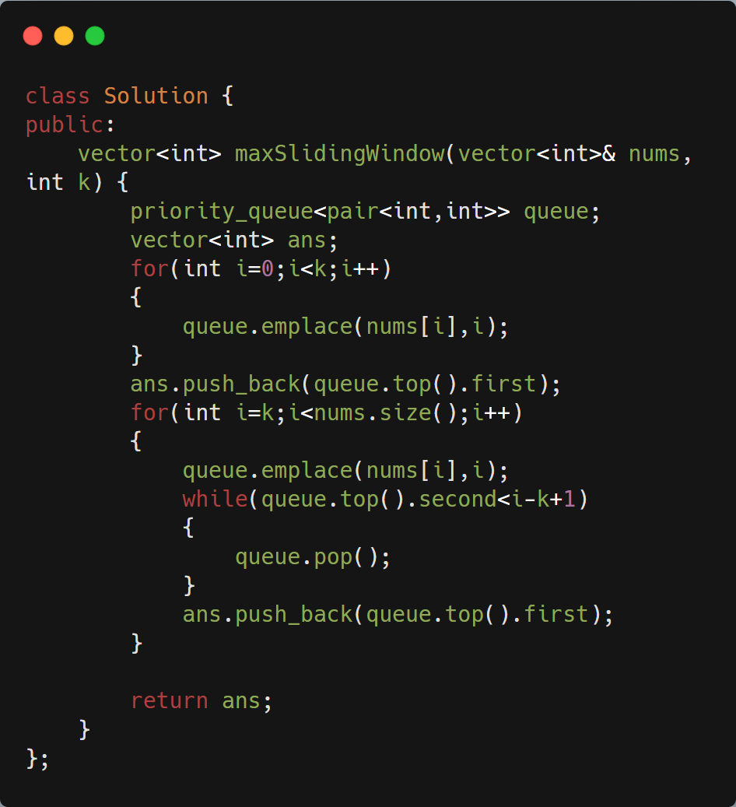
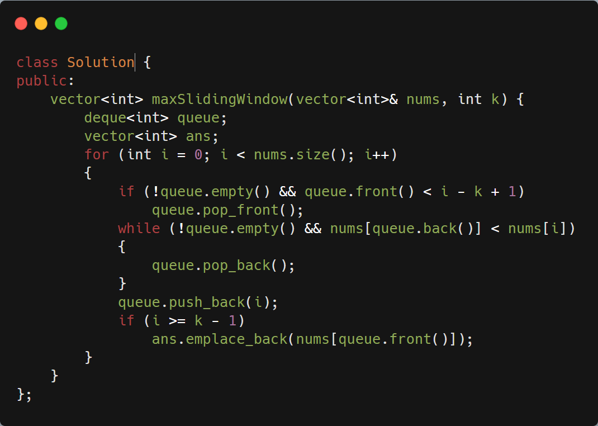

## 239.滑动窗口最大值

### 题目描述：

给你一个整数数组 nums，有一个大小为 k 的滑动窗口从数组的最左侧移动到数组的最右侧。你只可以看到在滑动窗口内的 k 个数字。滑动窗口每次只向右移动一位。

返回滑动窗口中的最大值。

##### 示例：

示例 1：

输入：`nums = [1,3,-1,-3,5,3,6,7], k = 3`
输出：`[3,3,5,5,6,7]`
解释：
滑动窗口的位置                最大值

---------------               -----
[1  3  -1] -3  5  3  6  7       3
 1 [3  -1  -3] 5  3  6  7       3
 1  3 [-1  -3  5] 3  6  7       5
 1  3  -1 [-3  5  3] 6  7       5
 1  3  -1  -3 [5  3  6] 7       6
 1  3  -1  -3  5 [3  6  7]      7

示例 2：

输入：`nums = [1], k = 1`
输出：`[1]`

[示例 3：

输入：`nums = [1,-1], k = 1`
输出：`[1,-1]`

示例 4：

输入：`nums = [9,11], k = 2`
输出：`[11]`

示例 5：

输入：`nums = [4,-2], k = 2`
输出：`[4]`

##### 提示：

- `1 <= nums.length <= 105`
- `-104 <= nums[i] <= 104`
- `1 <= k <= nums.length`

### 解答：

- #### 优先队列求解

  1. 首先将第一个滑动窗口的元素都放进优先队列，用`pair<int.int>`存储，用值作为第一个键（方便排序），用下标作为第二个键

  2. 弹出第一个元素即为当前窗口最大的值，随后进入循环，滑动窗口每滑动一次，将新元素放入优先队列，随后弹出最大的元素，此时需要判断当前元素是否在滑动窗口的范围内，若不在则弹出该元素，然后判断下一个最大值，直到在滑动窗口范围内，将该元素为该滑动窗口最大值

  3. 复杂度分析

     时间复杂度：`O(nlogn)`，其中 `n` 是数组 `nums` 的长度。在最坏情况下，数组 `nums `中的元素单调递增，那么最终优先队列中包含了所有元素，没有元素被移除。由于将一个元素放入优先队列的时间复杂度为 `O(logn)`，因此总时间复杂度为 `O(nlogn)`。

     空间复杂度：`O(n)`，即为优先队列需要使用的空间。这里所有的空间复杂度分析都不考虑返回的答案需要的`O(n)` 空间，只计算额外的空间使用。

     

  

- #### 单调队列求解

  单调队列求解：头尾都可以高效插入弹出的双向队列，和vector的区别是
  back指塞入元素的一方，front则指寻常意义的队列另一端

  1. 假使序列为5，3，4，1
  2. 首先将5压入单调队列，然后判断3，3<5，所以5继续在队列里，此时在将来的滑动窗口里，当5弹出后，3有可能成为最大值，所以应该将3保留在队列里
  3. 接下来判断4，4>3,所以只要4进入了队列，3永远不可能成为最大值，所以从尾部弹出
  4. 即每次队列首部都是最大值，但是需要判断当前最大值是否还在滑动窗口内，若不在则从头部弹出

  

  压缩后的写法：多了`n`次判断的基本操作

  

- #### 分块+预处理求解

待完成……