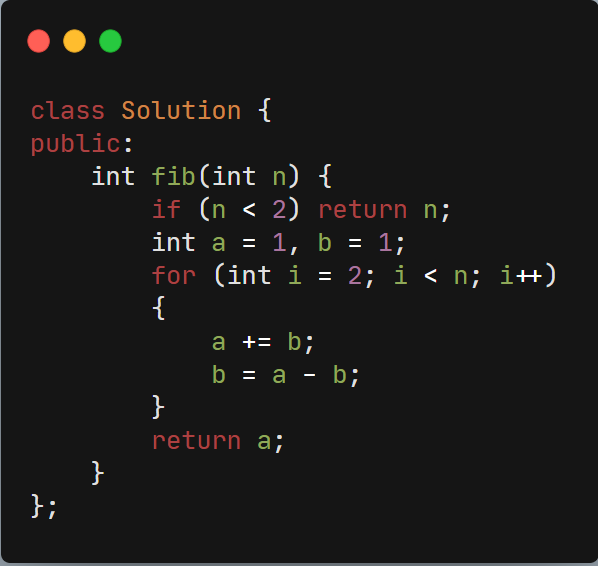

## 509.斐波那契数


### 题目描述：

斐波那契数，通常用 F(n) 表示，形成的序列称为 斐波那契数列 。该数列由 0 和 1 开始，后面的每一项数字都是前面两项数字的和。也就是：

```
F(0) = 0，F(1) = 1
F(n) = F(n - 1) + F(n - 2)，其中 n > 1
给你 n ，请计算 F(n) 。
```


##### 示例：

示例 1：

```
输入：2
输出：1
解释：F(2) = F(1) + F(0) = 1 + 0 = 1
```


示例 2：

```
输入：3
输出：2
解释：F(3) = F(2) + F(1) = 1 + 1 = 2
```

示例 3：

```
输入：4
输出：3
解释：F(4) = F(3) + F(2) = 2 + 1 = 3
```


##### 提示：

- `0 <= n <= 30`

### 解答：

- #### 滚动数组求解

  如果小于2直接返回
  如果大于2，则此时a为f(2)的值，b为f(1)的值
  令a=a+b则让a为f(3)的值，此时b=a-b则让b为原来a的值即f(2)的值
  以此类推滚动数组求解

  
