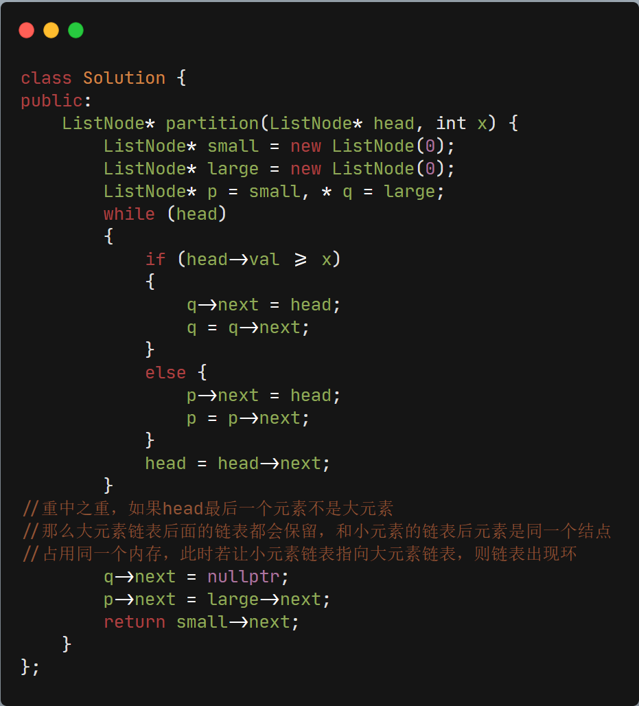

## 86.分隔链表


### 题目描述：

给你一个链表和一个特定值 x ，请你对链表进行分隔，使得所有小于 x 的节点都出现在大于或等于 x 的节点之前。

你应当保留两个分区中每个节点的初始相对位置。

##### 示例：

```
输入：head = 1->4->3->2->5->2, x = 3
输出：1->2->2->4->3->5
```

### 解答：

- #### 遍历解法（大节点和小节点分别存储在两个链表然后拼接）

  分隔链表，因为要求保留两节点的初始相对位置，所以不能采用头插+尾插的方法

  需特别注意，举例说明：

  输入：`head = 1->4->3->2->5->2`

  当循环遍历结束以后

  此时小链表为：`small->1->2->2(->null)`,括号里为实际指向， 并不是在循环中拼接的链表

  此时大链表为：`large->4->3->5(->2->null)`,因为均用head指针赋值，所以操作实际意义为将head指针及其后继节点都拼接到了链表上，此时两链表最后的`2->null`节点为同一个节点，若不将大链表后续赋空值，此时拼接链表操作相当于大链表最后一个节点指向自己的首元元素节点，出现了环，所以下方代码让`large->next=NULL;`是重点。

  
